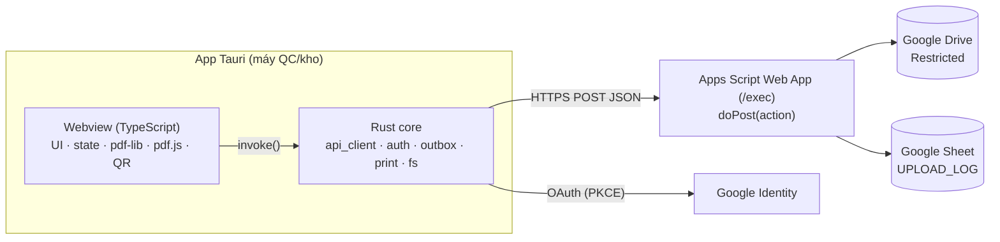
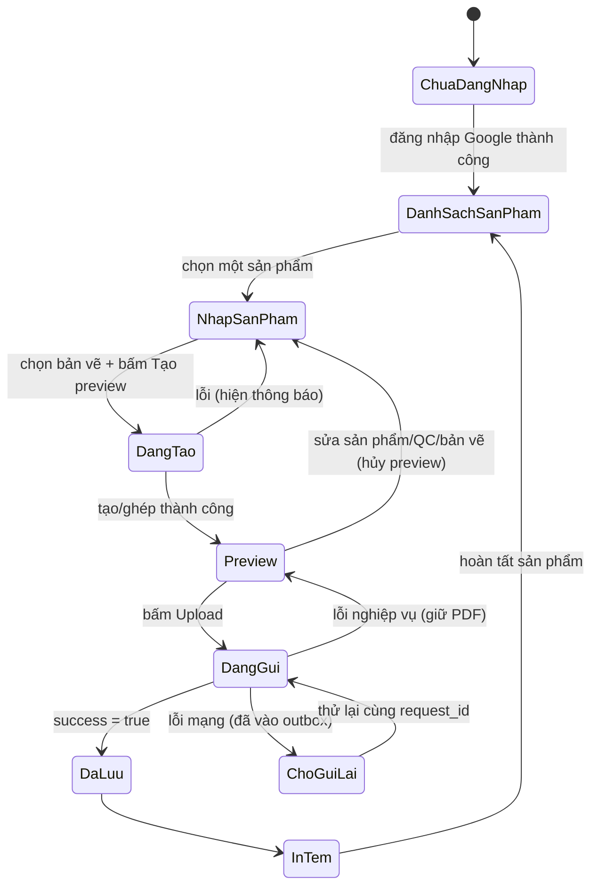
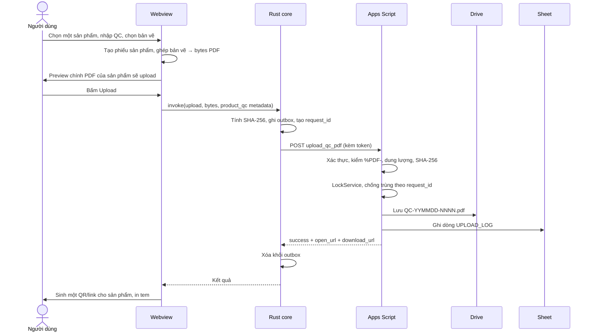

# Kiến trúc chi tiết — App QC số (Tauri + Apps Script)

Phiên bản tài liệu: 1.1 · Ngày: 24/09/2026
Dựa trên: `KIEN_TRUC_QC_SO_TOI_GIAN.md` (nghiệp vụ) và quyết định dùng **Tauri** làm ứng dụng desktop, **Google Apps Script** làm server.

**Mô hình nghiệp vụ chính:** product-centric — mỗi sản phẩm/lô/phiếu tạo một hồ sơ QC độc lập, một PDF, một lần upload và một QR/link.

---

## 1. Mục tiêu và phạm vi

### 1.1 Mục tiêu
Người dùng nhập thông tin sản phẩm và QC, chọn PDF bản vẽ, xem trước **PDF hoàn chỉnh của một sản phẩm** (phiếu QC + bản vẽ). Khi xác nhận, app upload **đúng PDF đã xem trước** lên server. Server lưu PDF vào Google Drive, ghi một dòng hồ sơ cho sản phẩm vào Google Sheet, trả về link. Upload thành công mới được in **một tem QR cho sản phẩm đó**. Nhân viên QC quét tem để mở hồ sơ PDF (chỉ tài khoản Google được cấp quyền mới mở được).

### 1.2 Trong phạm vi
- Nhập danh sách sản phẩm (nhập tay, dán từ Excel), chọn từng sản phẩm để nhập QC.
- Tạo **một hồ sơ QC cho một sản phẩm**: phiếu QC + các trang bản vẽ liên quan.
- Preview, upload và lưu mỗi hồ sơ như một đơn vị độc lập.
- Ghi một dòng `UPLOAD_LOG` cho mỗi hồ sơ sản phẩm.
- Sinh **một QR/link cho mỗi hồ sơ** sau khi upload thành công.
- Hàng đợi gửi lại theo từng sản phẩm; tìm, mở lại và in lại tem của từng hồ sơ.
- Có thể xử lý nhiều sản phẩm tuần tự, nhưng không gộp nhiều sản phẩm vào cùng một PDF/QR.
- Trong một hồ sơ, một sản phẩm có thể có nhiều dòng kết quả đo và nhiều PDF bản vẽ tham chiếu; thứ tự PDF người dùng chọn được giữ nguyên khi ghép.

### 1.3 Ngoài phạm vi
- Trang tra cứu hồ sơ QC riêng (PDF chính là hồ sơ).
- Lưu dữ liệu đo chi tiết trong Sheet (nằm trong PDF).
- Backend riêng ngoài Apps Script.

---

## 2. Nguyên tắc thiết kế

1. **Preview = file upload.** Byte PDF đã preview được giữ nguyên và gửi đi; server không tạo lại. Kiểm chứng bằng SHA-256.
2. **Tem chỉ sinh sau khi upload thành công** (đã có file Drive *và* dòng Sheet).
3. **Server mỏng.** Apps Script chỉ xác thực, kiểm tra, lưu, ghi log, trả link.
4. **Mỗi loại dữ liệu một nguồn sự thật:** kết quả QC trong PDF; chỉ mục tra cứu trong Sheet; quyền truy cập ở Drive.
5. **Rust lo mạng và bí mật, webview lo giao diện và PDF.** Webview không giữ token, không gọi thẳng server.
6. **Chịu lỗi mạng:** mọi upload đi qua outbox trên đĩa và có `request_id` để gửi lại an toàn.
7. **Một sản phẩm là một hồ sơ:** một `product_qc` có một PDF, một dòng log, một `request_id` và một QR/link.
8. **Không có upload gộp:** lỗi của một sản phẩm không làm mất hoặc làm sai hồ sơ của sản phẩm khác.

---

## 3. Kiến trúc tổng thể



### 3.1 Phân công trách nhiệm

| Lớp | Trách nhiệm | Không làm |
| --- | --- | --- |
| Webview (TS) | Form, dán Excel, vẽ phiếu QC, ghép bản vẽ, preview, dựng chuỗi QR, dàn trang tem | Gọi mạng trực tiếp, giữ token |
| Rust core | Gọi HTTP, đăng nhập Google, kho token, outbox, hộp thoại chọn file, in, tính SHA-256 | Dựng PDF, logic giao diện |
| Apps Script | Xác thực người dùng, kiểm tra PDF, cấp số, lưu Drive, ghi Sheet, chống trùng, trả link | Tạo/ghép PDF |
| Drive | Lưu PDF, kiểm soát quyền mở/tải | — |
| Sheet | Chỉ mục hồ sơ theo sản phẩm/lô/phiếu | Lưu dữ liệu đo |

### 3.2 Vì sao Rust gọi HTTP thay vì `fetch` trong webview
- Tránh CORS/preflight (Apps Script không trả header CORS chuẩn cho mọi trường hợp).
- Xử lý redirect 302 của `/exec` sang `script.googleusercontent.com` một cách chủ động.
- Token và cấu hình không lộ ra JavaScript.
- Dễ thêm timeout, retry, ghi log cục bộ.

---

## 4. Cấu trúc dự án

```
qc-app/
├─ package.json
├─ src/                          # Webview (TypeScript)
│  ├─ main.ts
│  ├─ state/machine.ts           # máy trạng thái
│  ├─ domain/
│  │  ├─ product.ts              # sản phẩm/lô hàng + kiểm tra hợp lệ
│  │  ├─ product-qc.ts           # hồ sơ QC của một sản phẩm
│  │  ├─ paste-excel.ts          # phân tích dữ liệu dán từ Excel
│  │  └─ qc.ts                   # dòng đo/kiểm tra
│  ├─ pdf/
│  │  ├─ qc-sheet.ts             # vẽ phiếu QC (pdf-lib + fontkit)
│  │  ├─ merge.ts                # ghép bản vẽ (copyPages)
│  │  └─ fonts/                  # font Unicode nhúng (hỗ trợ tiếng Việt)
│  ├─ preview/viewer.ts          # pdf.js: xem từng trang, đếm trang
│  ├─ label/
│  │  ├─ payload.ts              # dựng payload một QR/link cho sản phẩm
│  │  ├─ qr.ts                   # sinh QR
│  │  └─ layout.ts               # khổ tem, bố cục (giữ từ bản HTML hiện tại)
│  ├─ ui/                        # màn hình, component
│  └─ api.ts                     # lớp bọc invoke() sang Rust
├─ src-tauri/
│  ├─ tauri.conf.json
│  ├─ capabilities/              # quyền plugin (v2)
│  └─ src/
│     ├─ main.rs
│     ├─ commands.rs             # lệnh expose cho webview
│     ├─ api_client.rs           # reqwest, redirect, retry, timeout
│     ├─ auth.rs                 # OAuth PKCE, làm mới token, kho token
│     ├─ outbox.rs               # hàng đợi trên đĩa
│     ├─ hash.rs                 # SHA-256
│     ├─ print.rs                # in tem
│     └─ config.rs               # URL Web App, khổ tem, máy in
└─ apps-script/
   ├─ appsscript.json            # manifest, scopes
   ├─ Code.gs                    # doGet, doPost, router action
   ├─ Auth.gs                    # xác minh token, danh sách được phép
   ├─ Config.gs                  # FOLDER_ID, SHEET_ID, giới hạn
   ├─ DriveStore.gs              # lưu/xóa file
   ├─ SheetLog.gs                # ghi/tìm UPLOAD_LOG theo sản phẩm
   ├─ Sequence.gs                # cấp số QC-YYMMDD-NNNN
   └─ Chunks.gs                  # upload chia nhỏ (nếu cần)
```

### 4.1 Plugin Tauri v2 dự kiến
| Plugin | Dùng cho |
| --- | --- |
| `dialog` | Chọn PDF bản vẽ, chọn nơi lưu |
| `fs` | Đọc bản vẽ, ghi outbox |
| `opener` | Mở `open_url` bằng trình duyệt |
| `store` | Cấu hình (URL Web App, khổ tem, máy in) |
| `updater` | Tự cập nhật app |
| Kho khóa hệ điều hành (ví dụ crate `keyring`) | Lưu refresh token |

---

## 5. Máy trạng thái phía client



Quy tắc bất biến:
- Nút **Upload** chỉ bật ở `Preview`; khóa ngay khi vào `DangGui`.
- Mỗi lần chỉ có một `ProductQC` đang được preview/upload.
- Mọi thay đổi sản phẩm, QC hoặc bản vẽ hủy preview hiện tại.
- Nút **In tem** chỉ bật ở `DaLuu` (có `open_url`).
- Lỗi tạo/ghép/preview: báo ngay, không cho upload.
- Nhiều sản phẩm được xử lý tuần tự; sản phẩm lỗi không làm hỏng các sản phẩm đã hoàn tất.

---

## 6. Luồng chính (tuần tự)



---

## 7. Hợp đồng API

### 7.1 Quy ước chung
- Một endpoint `/exec`, `doPost(e)` đọc JSON từ `e.postData.contents`, điều hướng theo `action`.
- Apps Script **không đặt được mã HTTP** cho phản hồi (luôn 200), nên mọi kết quả nằm trong JSON.
- `doPost` không đọc được header tùy ý một cách đáng tin, nên **token gửi trong body**.
- Mọi phản hồi có `api_version`. App so sánh với phiên bản nó hỗ trợ; lệch thì báo cập nhật app.

**Khung yêu cầu:**
```json
{
  "action": "upload_qc_pdf",
  "api_version": 1,
  "auth": { "id_token": "..." },
  "data": { }
}
```

**Khung phản hồi lỗi:**
```json
{ "success": false, "api_version": 1, "code": "SHEET_WRITE_FAILED", "message": "…", "retryable": true }
```

### 7.2 Mã lỗi
| Mã | Ý nghĩa | Thử lại? |
| --- | --- | --- |
| `UNAUTHENTICATED` | Token thiếu/hết hạn/không hợp lệ | Sau khi làm mới token |
| `FORBIDDEN` | Email không nằm trong danh sách được phép | Không |
| `INVALID_INPUT` | Thiếu/sai khóa sản phẩm hoặc sai định dạng | Không |
| `NOT_A_PDF` | Không có chữ ký `%PDF-` | Không |
| `TOO_LARGE` | Vượt ngưỡng dung lượng | Không |
| `HASH_MISMATCH` | SHA-256 không khớp | Có |
| `LOCK_TIMEOUT` | Không lấy được khóa | Có |
| `DRIVE_FAILED` | Lỗi lưu Drive | Có |
| `SHEET_WRITE_FAILED` | Lỗi ghi Sheet (file đã được dọn) | Có |
| `VERSION_MISMATCH` | `api_version` không tương thích | Không |
| `INTERNAL` | Lỗi khác | Có |

### 7.3 Các action

#### `ping`
Kiểm tra kết nối, phiên bản, quyền.
```json
// data: {}
{ "success": true, "api_version": 1, "user": "a@congty.com", "allowed": true }
```

#### `upload_qc_pdf` (một hồ sơ sản phẩm)
```json
{
  "action": "upload_qc_pdf",
  "data": {
    "request_id": "uuid-v4",
    "product_key": "AUTM260580-0|MKAC-FBT-260817|2410011-FR1-014|NK-FBT-260909-10",
    "project": "AUTM260580-0",
    "po": "MKAC-FBT-260817",
    "part_no": "2410011-FR1-014",
    "lot_no": "N/A",
    "supplier": "FBT",
    "quantity": 1,
    "unit": "PCS",
    "slip_no": "NK-FBT-260909-10",
    "received_date": "2026-09-09",
    "page_count": 5,
    "size_bytes": 1234567,
    "sha256": "hex…",
    "pdf_base64": "…"
  }
}
```
Thành công:
```json
{
  "success": true, "api_version": 1,
  "qc_no": "QC-260924-0001",
  "product_key": "AUTM260580-0|MKAC-FBT-260817|2410011-FR1-014|NK-FBT-260909-10",
  "file_name": "QC-260924-0001.pdf",
  "file_id": "FILE_ID",
  "open_url": "https://drive.google.com/file/d/FILE_ID/view",
  "download_url": "URL do getDownloadUrl() trả về",
  "duplicate": false
}
```
Nếu `request_id` đã tồn tại: trả lại kết quả cũ với `duplicate: true`, không tạo file mới.

#### `upload_init` / `upload_chunk` / `upload_finish` (chia nhỏ, chỉ bật nếu Giai đoạn 0 cho thấy cần)
| Bước | Dữ liệu | Server làm |
| --- | --- | --- |
| `upload_init` | `request_id`, `product_key`, metadata sản phẩm, `page_count`, `size_bytes`, `sha256`, `chunk_count` | Tạo phiên tạm, trả `upload_id` |
| `upload_chunk` | `upload_id`, `index`, `data_base64` | Lưu phần vào nơi tạm; gửi lại cùng `index` an toàn |
| `upload_finish` | `upload_id` | Ghép, kiểm `%PDF-` + SHA-256, lưu Drive, ghi Sheet, trả kết quả như `upload_qc_pdf` |

Chỉ `upload_finish` (hoặc `upload_qc_pdf`) mới trả `success: true` cho việc lưu. Phải có cơ chế dọn phiên tạm quá hạn.

---

## 8. Apps Script chi tiết

### 8.1 Triển khai
- Deploy **Web App**, **Execute as: Me** (file thuộc một chủ, dễ quản lý quyền).
- Chế độ truy cập và cách xác minh người gọi: xem mục 9 (cần thử thật ở Giai đoạn 0).
- Mỗi lần đổi mã tạo phiên bản deploy mới; URL `/exec` giữ cố định nếu cập nhật deployment hiện có. App lưu URL trong cấu hình.

### 8.2 Luồng `uploadQcPdf`
1. **Xác thực** (mục 9): lấy email, kiểm tra trong danh sách được phép.
2. **Kiểm tra đầu vào:** đủ khóa sản phẩm (`project`, `po`, `part_no`, `slip_no` theo quy định); `request_id` và `product_key` đúng dạng; base64 giải mã được.
3. **Kiểm tra file:** byte đầu là `%PDF-`; dung lượng không vượt `MAX_BYTES`; SHA-256 khớp `sha256`.
4. **Khóa:** `LockService.getScriptLock().waitLock(...)`; hết hạn → `LOCK_TIMEOUT`.
5. **Chống trùng:** tìm `request_id` trong `UPLOAD_LOG`; có thì trả kết quả cũ. Không gộp nhiều sản phẩm vào một request.
6. **Cấp số:** `QC-YYMMDD-NNNN` (quy tắc ở mục 15).
7. **Lưu Drive:** tạo một file cho một hồ sơ sản phẩm trong thư mục cố định; lấy `file_id`, `getUrl()`, `getDownloadUrl()`.
8. **Ghi Sheet:** thêm một dòng vào `UPLOAD_LOG`.
9. **Nếu bước 8 lỗi:** `file.setTrashed(true)`, trả `SHEET_WRITE_FAILED`. Nếu dọn cũng lỗi, ghi vào sheet `ERROR_LOG` để xử lý tay.
10. **Nhả khóa** trong `finally`, trả `success: true` chỉ khi cả bước 7 và 8 xong.

> Giữ phần trong khóa càng ngắn càng tốt (cấp số, ghi Sheet); kiểm tra và giải mã làm trước khi lấy khóa.

### 8.3 Quyền (scopes) tối thiểu
Drive (tạo file trong thư mục), Sheets (ghi log), và `script.external_request` nếu xác minh token bằng `UrlFetchApp`. Khai báo rõ trong `appsscript.json`.

---

## 9. Xác thực và phân quyền

### 9.1 Phương án
| | A. Khóa bí mật dùng chung | B. Đăng nhập Google trong app (khuyến nghị) |
| --- | --- | --- |
| Độ phức tạp | Thấp | Trung bình |
| Biết ai upload | Không | Có (cột `uploaded_by`) |
| Thu hồi | Đổi khóa cho mọi máy | Xóa email khỏi danh sách |
| Rủi ro | Lộ khóa → ai cũng gọi được API | Phải giữ OAuth client và làm mới token |

### 9.2 Phương án B — luồng đề xuất
1. App mở trình duyệt hệ thống tới màn hình đồng ý của Google, dùng **OAuth 2.0 + PKCE** với redirect về `127.0.0.1` (loopback).
2. Rust nhận `code`, đổi lấy `id_token` và `refresh_token`.
3. `refresh_token` lưu trong **kho khóa của hệ điều hành**; `id_token` giữ trong bộ nhớ Rust.
4. Mỗi request, Rust gắn `auth.id_token` vào body. Token hết hạn (thường sau khoảng 1 giờ) thì tự làm mới trước khi gọi.
5. Apps Script xác minh `id_token` (ví dụ gọi endpoint `tokeninfo` của Google bằng `UrlFetchApp`, kiểm tra `aud` khớp OAuth client ID của app, `exp`, `email_verified`), rồi lấy `email`.
6. Đối chiếu `email` với sheet `ALLOWED_USERS` (hoặc Google Group). Không có → `FORBIDDEN`.

### 9.3 Điều cần kiểm chứng ở Giai đoạn 0
- Với Web App deploy "Execute as: Me", chế độ truy cập nào cho phép app desktop gọi được mà vẫn bảo đảm chỉ người được phép dùng được (thường phải cho gọi ẩn danh rồi tự xác minh token trong mã).
- Endpoint xác minh token có chịu được tải và độ trễ của việc gọi mỗi request; cân nhắc lưu tạm kết quả xác minh bằng `CacheService` trong thời gian ngắn.
- Độ trễ tổng của một lần gọi.

Kết quả thử nghiệm quyết định chốt phương án; cấu trúc `Auth.gs` được tách riêng để đổi được mà không đụng nghiệp vụ.

### 9.4 Quyền mở/tải PDF trên Drive
- Thư mục Drive để **Restricted**, chia sẻ cho Google Group của nhân viên QC; không dùng "Anyone with the link".
- Quyền mở PDF là quyền Drive của người quét, **độc lập** với quyền gọi API upload. Hai danh sách này nên khớp nhau nhưng quản lý riêng.
- Người quét đăng nhập nhiều tài khoản Google cần chọn đúng tài khoản được chia sẻ.

---

## 10. Rust core chi tiết

### 10.1 Lệnh expose cho webview (`invoke`)
| Lệnh | Việc |
| --- | --- |
| `auth_login` / `auth_logout` / `auth_status` | Đăng nhập, đăng xuất, trạng thái + email |
| `pick_pdf` | Hộp thoại chọn PDF bản vẽ, trả bytes |
| `api_ping` | Gọi `ping` |
| `upload_pdf` | Nhận bytes + metadata một sản phẩm, ghi outbox, gọi server, trả kết quả |
| `outbox_list` / `outbox_retry` / `outbox_discard` | Quản lý hàng đợi |
| `open_url` | Mở link bằng trình duyệt |
| `print_label` | Gửi tem ra máy in |
| `config_get` / `config_set` | Cấu hình theo máy |

### 10.2 `api_client`
- `reqwest` với **theo redirect** (chuyển `/exec` → `script.googleusercontent.com`); kiểm chứng POST vẫn giữ body sau redirect ở Giai đoạn 0.
- Timeout hợp lý theo kích thước (upload lớn cần dài hơn `ping`).
- Retry có backoff cho lỗi mạng và mã `retryable: true`; không retry lỗi nghiệp vụ.
- Phân biệt: lỗi mạng (chưa biết server đã xử lý chưa → **gửi lại cùng `request_id`**) và phản hồi `success: false` (server đã trả lời).
- Ghi log cục bộ (không ghi nội dung PDF, không ghi token).

### 10.3 `outbox`
Thư mục dữ liệu app:
```
outbox/
  <request_id>/
    meta.json     # endpoint, product_key, QC metadata, page_count, sha256, size, trạng thái, số lần thử
    file.pdf      # PDF đã preview
```
Trạng thái thực tế: `pending` → `sending` → (`pending` khi lỗi retry được | `failed` khi lỗi dữ liệu/quyền).
- Ghi file **trước** khi gửi; ghi `meta.json` bằng cách ghi tạm rồi đổi tên để tránh hỏng khi mất điện.
- Chỉ xóa mục khi nhận `success: true`.
- Khi mở app hoặc có mạng trở lại, app quét outbox và thử lại các mục `pending`/`sending`.
- Khi nhận `success: true`, kết quả được trả về UI để cập nhật card; item không còn trong outbox vì metadata thành công đã nằm trong Document Library.

### 10.4 `auth`
- PKCE, máy chủ loopback tạm trên cổng ngẫu nhiên, đóng ngay sau khi nhận `code`.
- Refresh token trong kho khóa hệ điều hành; không ghi vào file cấu hình.
- Đăng xuất xóa token và (tùy chọn) thu hồi ở Google.

### 10.5 `print`
- Xác định sau khi chốt hệ điều hành và máy in tem (mục 15). Tối thiểu: in từ webview với CSS `@page` đặt đúng khổ; nếu cần kiểm soát sâu hơn, dùng lệnh hệ điều hành hoặc thư viện in gốc.

---

## 11. Webview chi tiết

### 11.1 Tạo phiếu QC (`qc-sheet.ts`)
- Dùng **pdf-lib** + **@pdf-lib/fontkit**, **nhúng font Unicode** (ví dụ Roboto/Noto Sans) vì font chuẩn của PDF không hiển thị được dấu tiếng Việt.
- Bố cục theo ảnh mẫu giấy QC trong repo. Dữ liệu vào là đối tượng `Product` + `ProductQC`/`QcSheet` đã kiểm tra hợp lệ.
- Phiếu dài hơn một trang: tự xuống trang, lặp tiêu đề bảng.

### 11.2 Ghép bản vẽ (`merge.ts`)
- Nạp PDF bản vẽ bằng pdf-lib, `copyPages` vào sau phiếu, giữ nguyên thứ tự trang.
- UI giữ danh sách nhiều file PDF; bộ ghép chạy tuần tự theo thứ tự danh sách để mỗi file được nối sau file trước.
- Bản vẽ có mật khẩu/hỏng: báo lỗi rõ ràng, không cho tiếp tục.
- Đầu ra: `Uint8Array` duy nhất, dùng cho cả preview và upload.

### 11.3 Preview (`viewer.ts`)
- **pdf.js** hiển thị **chính** `Uint8Array` đó, từng trang, hiện tổng số trang.
- Preview và upload dùng **cùng một mảng byte** trong bộ nhớ; không tạo lại giữa hai bước.

### 11.4 Nhập liệu theo sản phẩm
- Danh sách sản phẩm ban đầu: mã dự án, PO, mã NCC, mã hàng, tên hàng, số lượng, đơn vị tính, số phiếu nhập kho, ngày nhập kho.
- Nhập tay hoặc dán từ Excel (`paste-excel.ts`, giữ hành vi của `260825-label-generator.html`).
- Người dùng chọn **một sản phẩm** để nhập phần QC, chọn bản vẽ và tạo hồ sơ.
- Có thể dán nhiều dòng tab-separated từ Excel; parser bỏ dòng tiêu đề, kiểm tra đủ 9 cột và báo đúng dòng lỗi.
- `ProductQc.measurements` là danh sách `MeasurementRow`; mỗi dòng tương ứng một mẫu đo và được đánh số lại khi người dùng xóa dòng.
- UI cho phép kéo-thả hoặc chọn nhiều PDF, nhưng các file vẫn thuộc cùng sản phẩm đang chọn và không tạo ra nhiều QR.
- Kiểm tra: bắt buộc khóa sản phẩm (dự án, PO, mã hàng; thêm số phiếu/lô nếu quy trình yêu cầu), số lượng là số, ngày hợp lệ.
- Có thể xử lý nhiều sản phẩm tuần tự; mỗi sản phẩm có preview, upload, outbox và trạng thái độc lập.

### 11.5 Tem và QR (`label/`)
QR của mỗi sản phẩm chứa JSON compact có version, gồm metadata tra cứu và `pdf_url` trả về sau khi upload:
```text
https://drive.google.com/file/d/FILE_ID/view
```
- Thông tin sản phẩm (mã hàng, PO, số lượng, nhà cung cấp, phiếu nhập) được in rõ trên tem; không nhồi vào QR.
- Chỉ dựng QR từ kết quả `success: true`.
- JSON compact giúp máy quét đọc được thông tin sản phẩm ngay cả khi không mở mạng; `pdf_url` vẫn giữ đường dẫn tới hồ sơ PDF.
- Payload dùng schema có version và escaping chuẩn; không dùng chuỗi nhiều dòng hoặc CSV không có schema.
- Giữ các tùy chọn khổ tem/layout hiện có.

---

## 12. Mô hình dữ liệu

### 12.1 Sheet `UPLOAD_LOG`
Mỗi dòng là **một hồ sơ QC của một sản phẩm**; không có dòng đại diện cho nhiều sản phẩm gộp chung.
| Cột | Nội dung |
| --- | --- |
| `uploaded_at` | Thời điểm upload thành công |
| `qc_no` | Số hồ sơ QC do server cấp |
| `product_key` | Khóa ổn định của sản phẩm/lô/phiếu |
| `project` | Mã dự án |
| `po` | PO |
| `part_no` | Mã hàng |
| `lot_no` | Số lot hàng |
| `quantity` | Số lượng của sản phẩm |
| `unit` | Đơn vị tính |
| `supplier` | Nhà cung cấp |
| `slip_no` | Số phiếu nhập kho |
| `received_date` | Ngày nhập kho, lưu chuẩn `YYYY-MM-DD` |
| `file_name` | Tên PDF đã lưu |
| `file_id` | ID file trên Drive |
| `open_url` | Link mở PDF |
| `download_url` | Link tải PDF |
| `request_id` | Mã kỹ thuật chống trùng |
| `uploaded_by` | Email người upload (khi dùng phương án B) |
| `sha256` | Băng đối chiếu file |

Khóa hàng tiêu đề, tạo bộ lọc theo `project`, `po`, `part_no`, `product_key`. **Không** lưu dữ liệu đo hay nội dung phiếu.

### 12.2 Các sheet phụ
| Sheet | Dùng cho |
| --- | --- |
| `ALLOWED_USERS` | Danh sách email được gọi API (nếu không dùng Google Group) |
| `ERROR_LOG` | File lưu dở không dọn được, lỗi cần xử lý tay |
| `COUNTERS` (hoặc Script Properties) | Bộ đếm số thứ tự, theo quy tắc ở mục 15 |

---

## 13. Xử lý lỗi và độ tin cậy

| Tình huống | Hành vi |
| --- | --- |
| Tạo/ghép PDF lỗi | Báo ngay, không cho upload |
| Mạng rớt khi gửi | PDF đã ở outbox; cho thử lại với **cùng `request_id`** |
| Bấm Upload hai lần | Nút bị khóa; server chống trùng theo `request_id` |
| Ghi Sheet lỗi | Server xóa file vừa tạo, trả `SHEET_WRITE_FAILED`, không sinh tem |
| Dọn file lỗi | Ghi `ERROR_LOG` để xử lý tay |
| Hai người upload cùng lúc | `LockService` tuần tự hóa cấp số + ghi Sheet |
| Token hết hạn | Tự làm mới; không được thì yêu cầu đăng nhập lại, giữ nguyên outbox |
| Server đổi phiên bản | `VERSION_MISMATCH` → hướng dẫn cập nhật app |
| App tắt giữa chừng | Mở lại: hiện mục outbox chưa xong |
| Không có mạng lúc mở app | Cho soạn và preview; chặn upload, hiển thị trạng thái offline |

---

## 14. Bảo mật

- Drive **Restricted**; không "Anyone with the link".
- Danh sách người gọi API kiểm tra ở server (email từ token đã xác minh), không tin dữ liệu client.
- Server kiểm chữ ký `%PDF-`, dung lượng, SHA-256; không tin `size_bytes`/`page_count` do client khai.
- Token/khóa lưu trong kho khóa hệ điều hành; không đưa vào log, không đưa vào mã nguồn.
- Cấu hình CSP của Tauri chặt; chỉ cho webview gọi các lệnh cần thiết (capabilities v2), không cho `fetch` ra ngoài.
- Không ghi nội dung PDF hoặc token vào file log.
- **QR không bảo mật:** metadata sản phẩm và URL/file ID có thể bị nhìn thấy; chỉ hồ sơ PDF được bảo vệ bằng quyền Drive. Không đưa dữ liệu QC chi tiết ngoài các trường tra cứu đã thống nhất vào QR.
- Cập nhật app: bật chữ ký updater, phát hành qua kênh tin cậy.

---

## 15. Điểm cần chốt

| # | Vấn đề | Đề xuất |
| --- | --- | --- |
| 1 | Hệ điều hành máy dùng app (Windows / macOS / Linux) | Chốt sớm — ảnh hưởng in tem và đóng gói |
| 2 | Xác thực: A hay B | B, xác nhận qua Giai đoạn 0 |
| 3 | Quy tắc số `QC-YYMMDD-NNNN`: đặt lại theo ngày hay tăng liên tục; lưu bộ đếm ở đâu | Đặt lại theo ngày, lưu trong Sheet `COUNTERS` cùng khóa |
| 4 | **Mẫu phiếu QC**: đã có ảnh mẫu `b308ff59-b216-4fb6-b7c6-d6f699c12d6b.png` | Dùng ảnh hiện có để chốt model và bố cục; bổ sung ảnh khác nếu còn biến thể |
| 5 | Giới hạn dung lượng bản vẽ | Đo ở Giai đoạn 0, đặt `MAX_BYTES` theo kết quả |
| 6 | Cách quét QR ở xưởng | Mặc định QR một URL mở hồ sơ PDF; chốt bằng máy quét/điện thoại thực tế |
| 7 | Máy in tem và khổ tem | Chốt cùng mục 1 |
| 8 | Phạm vi xóa tài liệu | Xóa metadata khỏi Document Library local; chưa xóa file Drive vì cần quyền và quy trình riêng |
| 9 | Khóa một hồ sơ sản phẩm | Đề xuất `project + po + part_no + lot_no + slip_no`; nếu tái kiểm thì thêm `inspection_no` |
| 10 | Nhiều sản phẩm trong một lần nhập | Cho nhập/dán nhiều dòng nhưng tạo hồ sơ, upload và QR tuần tự từng sản phẩm |

---

## 16. Chiến lược kiểm thử

### 16.1 Đơn vị (webview)
- Phân tích dữ liệu dán Excel, kiểm tra hợp lệ.
- Dựng đúng một QR/link từ `open_url` của sản phẩm đã upload.
- Không cho tạo QR trước khi có `success: true`.
- Đếm trang PDF sau ghép; kiểm tra font tiếng Việt hiển thị đúng.

### 16.2 Đơn vị (Rust)
- Outbox: ghi/đọc/khôi phục sau khi tắt giữa chừng.
- Retry/backoff; phân loại lỗi mạng và lỗi nghiệp vụ.
- Tính SHA-256.

### 16.3 Tích hợp (với Apps Script thật, sheet/thư mục thử nghiệm)
- Upload PDF nhỏ, PDF lớn, PDF không hợp lệ, PDF sai SHA-256.
- Hai sản phẩm trong cùng danh sách → tạo hai hồ sơ, hai file và hai QR độc lập.
- Một sản phẩm lỗi → các sản phẩm khác vẫn tiếp tục được xử lý.
- Gửi lặp cùng `request_id` → `duplicate: true`, không tạo file thừa.
- Giả lập lỗi Sheet (đổi tên sheet) → file bị dọn, không sinh tem.
- Hai upload đồng thời → số thứ tự không trùng.
- Token hết hạn, email không được phép.

### 16.4 Nghiệm thu thực tế
- Tài khoản QC mở/tải được PDF; tài khoản khác bị từ chối.
- Mỗi sản phẩm có đúng một tem; quét tem in thật bằng máy quét và điện thoại dùng ở xưởng mở được đúng hồ sơ PDF.
- Hai sản phẩm cùng PO không bị nhầm file, nhầm QR hoặc nhầm dữ liệu.
- Cắt mạng giữa lúc upload, mở lại app, gửi lại thành công.

---

## 17. Đóng gói và vận hành

- Bản cài đặt theo hệ điều hành đã chốt; ký mã (code signing) nếu môi trường công ty yêu cầu.
- `updater` của Tauri với khóa ký riêng; phát hành theo kênh nội bộ.
- Cấu hình mặc định (URL Web App) nhúng sẵn, có thể ghi đè bằng `store`.
- Theo dõi: sheet `ERROR_LOG`, xem Executions của Apps Script khi có sự cố.
- Sao lưu: thư mục Drive và Sheet nằm trong quy trình sao lưu chung của công ty.
- Quản lý phiên bản: `api_version` ở server và app; đổi API không tương thích thì tăng phiên bản và phát hành app mới trước.

---

## 18. Lộ trình

| Giai đoạn | Kết quả bàn giao | Tiêu chí xong |
| --- | --- | --- |
| **0. Thử nghiệm rủi ro** | Tauri gọi `ping` và upload PDF lớn thật tới `/exec` | Biết: redirect ổn, giới hạn dung lượng, độ trễ, chế độ xác thực khả thi |
| **1. Khung** | Dự án Tauri; danh sách sản phẩm + tem hiện tại chạy trong app | Nhập/dán nhiều sản phẩm được; xử lý chọn từng sản phẩm |
| **2. Phiếu QC + ghép + preview** | Form QC của một sản phẩm, vẽ phiếu, chọn bản vẽ, ghép, xem từng trang | Preview đúng, dấu tiếng Việt đúng, khớp ảnh mẫu |
| **3. Server** | `doPost`, xác thực, Drive, Sheet, chống trùng, dọn file lỗi | Bộ kiểm thử tích hợp mục 16.3 qua |
| **4. Kết nối** | `api_client`, đăng nhập Google, outbox, (nếu cần) upload chia nhỏ | Upload từ app thành công, phục hồi được sau khi cắt mạng |
| **5. Tem + in** | QR một `open_url` cho từng sản phẩm, in trực tiếp, in lại tem | Quét thử trên máy in thật mở đúng PDF |
| **6. Nghiệm thu & đóng gói** | Bản cài đặt, updater, kiểm thử hai tài khoản, hướng dẫn | Kiểm thử mục 16.4 đạt |

---

## 19. Rủi ro chính

| Rủi ro | Ảnh hưởng | Giảm thiểu |
| --- | --- | --- |
| Giới hạn dung lượng/thời gian của Apps Script với PDF lớn | Upload thất bại | Đo ở Giai đoạn 0; upload chia nhỏ; giới hạn dung lượng bản vẽ |
| Chế độ truy cập Web App không hợp với app desktop | Phải đổi cách xác thực | Thử sớm; tách `Auth.gs` |
| Redirect/POST của `/exec` xử lý khác dự kiến | Lỗi kết nối | Kiểm chứng bằng reqwest ở Giai đoạn 0 |
| QR dài, khó quét trên tem nhỏ | Tem không dùng được | QR chỉ chứa một URL; thử máy in/khổ tem thật |
| Hồ sơ sản phẩm bị trùng hoặc nhầm khi cùng PO | Sai truy xuất QC | Chốt `product_key`, chống trùng theo `request_id`, kiểm thử hai sản phẩm gần giống |
| Mẫu phiếu QC có nhiều biến thể | Trễ Giai đoạn 2 | Dùng ảnh mẫu hiện có, version hóa template nếu cần |
| Hạn mức thực thi hằng ngày của Apps Script | Bị chặn khi tải cao | Ước lượng số upload/ngày; theo dõi Executions |
## 20. Quản lý tài liệu nội bộ theo card mã hàng

- Mỗi card mã hàng là một `InternalDocument` độc lập, có `documentId`, dữ liệu QC, nhiều dòng đo, danh sách bản vẽ, preview và trạng thái riêng.
- Khi đổi card, UI phải khôi phục đúng toàn bộ dữ liệu của card đó; không dùng chung preview hoặc danh sách bản vẽ giữa các card.
- Draft/preview chỉ tồn tại trong runtime. Local storage chỉ giữ metadata hồ sơ sau upload thành công; PDF bytes và đối tượng `File` cần được quản lý ở runtime, outbox hoặc Drive.
- `preview-ready` chỉ nghĩa là PDF đã được tạo trong app; chỉ upload backend thành công mới chuyển trạng thái sang `sent`.

## 21. Trạng thái triển khai backend

- `apps-script/` đã có API test cho `ping` và `upload_qc_pdf`; cấu hình bằng Script Properties, không lưu secret trong source.
- `src-tauri/src/outbox.rs` đã có hàng đợi bền vững theo `request_id`, lưu riêng `meta.json` và `file.pdf`, upload HTTP bằng Rust, retry sau restart/mất mạng và xóa item sau response thành công.
- Web App test thật đã xác nhận ping, upload, duplicate, sai SHA-256, PDF hỏng, concurrency và file gần 20 MiB. OAuth production vẫn chờ OAuth Client ID, PKCE loopback và kho token hệ điều hành.

## 22. Thư viện file upload và UX workspace

### Bảy cập nhật UX/UI và luồng upload

- Nút `Gửi hồ sơ` dùng trực tiếp `previewBytes`; PDF được preview và PDF upload là cùng một byte stream.
- URL Web App `/exec` được cấu hình trong hộp thoại trên topbar; frontend không lưu token.
- Event `digital-qc:upload-success` mang `documentId`, `requestId` và `productKey` để cập nhật đúng card.
- Badge workflow, stepper, server pill và message cập nhật động theo draft, preview-ready, uploading, sent hoặc error.
- Trường bắt buộc có inline error, `aria-invalid`, `aria-describedby` và focus vào lỗi đầu tiên.
- Nút thao tác chính có vùng chạm tối thiểu 44px; tạo preview/upload bị khóa trong lúc xử lý.
- Bảng đo dùng cuộn ngang ở màn hình hẹp; mobile hiển thị nhãn V1–V7 và Ngoại quan trong từng dòng.

- `InternalDocument.uploaded` là vùng metadata chuẩn cho file upload thành công: `qcNo`, `fileName`, `fileId`, `openUrl`, `downloadUrl`, `sentAt`.
- `uploadProductPdf` tự phát event `digital-qc:upload-success` sau response `success: true`; UI chuẩn hóa cả response camelCase/snake_case rồi gọi `markDocumentUploaded`. Vì vậy không có trạng thái “đã gửi” giả khi mạng hoặc server chưa sẵn sàng.
- Thư viện tài liệu lọc theo metadata `uploaded`, cho phép mở lại card và mở link Drive riêng của sản phẩm ngay cả khi card đang được chỉnh sửa cho lần kiểm tra mới. Nhiều mã hàng không dùng chung file hoặc QR.
- `topbar` dùng `position: sticky`; `sidebar` dùng sticky trên desktop và có `height/max-height` theo viewport. Trên mobile sidebar ẩn để không chiếm chỗ workspace.
- `recentInspectors` là danh sách local storage tối đa 5 giá trị, được cập nhật theo blur field `inspector` và hiển thị qua `datalist`.
- `#measurementRows` dùng gap 8px và fallback margin cho trình duyệt, giúp nhiều dòng mẫu tạo thành các khối scan tách biệt.
- Trường `visualResult` trên UI dùng native select với đúng hai giá trị nghiệp vụ `OK`/`NG`; giá trị rỗng chỉ là trạng thái chưa chọn.
- `DOCUMENT LIBRARY` dùng native `<details>/<summary>` đóng mặc định; chỉ render danh sách file khi người dùng mở thư viện để tránh danh sách dài chiếm màn hình.
- Khối tài liệu đang chọn hiển thị `product.partNo` làm tiêu đề chính; `documentId` chỉ còn ở dòng phụ để giữ khả năng truy vết nội bộ.
- Không có thao tác “lưu hồ sơ nội bộ” trong UI. `persistUploadedDocumentLibrary` chỉ chạy sau event upload thành công, vì vậy restart app không phục hồi draft chưa gửi.

### QR và in tem

- `InternalDocument.uploaded.qr` lưu `payload` từ `open_url`, thời điểm tạo, số lần in, mẫu tem cuối cùng và profile máy in cuối cùng. Đây là metadata nhỏ, không lưu ảnh QR/base64 vào local storage.
- QR chỉ xuất hiện trong Document Library sau upload thành công có link truy cập; hồ sơ chưa gửi hoặc upload lỗi không được xem như có QR.
- `QR Label Studio` cung cấp các preset A4 3×8, A4 2×4, tem cuộn 100×50 mm và 62×29 mm; profile Zebra, Brother, Godex, Windows system và generic A4 chọn preset phù hợp.
- Print sheet dùng payload đã lưu để dựng QR lại, hỗ trợ số lượng 1–100 bản và ghi lại `printCount/printedAt` sau khi mở hộp thoại in.
- Giai đoạn hiện tại dùng system print dialog để tương thích nhiều dòng máy in. In trực tiếp qua driver/Tauri native là hạng mục riêng, cần kiểm thử từng model và driver thực tế.

### Kiểm tra kết nối và thư viện local

- `pingServer` gửi action `ping` cùng `api_version` tới Web App; UI phân biệt `configured`, `checking`, `online` và `error`, không coi việc đã lưu URL là server đang hoạt động.
- Document Library lọc client-side theo `partNo`, `po`, `qcNo` và `documentId`; ô tìm kiếm vẫn nằm trong vùng `<details>` để không làm danh sách dài chiếm màn hình khi chưa mở.
- Nút xóa chỉ loại hồ sơ khỏi metadata local trên máy hiện tại, có xác nhận trước khi xóa; link/file trên Google Drive vẫn được giữ nguyên.

## 24. Điều kiện để hoàn tất các mốc production

- Cần URL Web App `/exec`, `DRIVE_FOLDER_ID`, `LOG_SPREADSHEET_ID` và một bộ PDF thử nghiệm để chạy kiểm thử server thật.
- Cần OAuth Client ID, redirect loopback, kho token hệ điều hành và danh sách tài khoản QC trước khi bật `ENFORCE_AUTH=true`.
- Cần ít nhất một model thực tế của Zebra, Brother hoặc Godex, khổ tem, driver và mẫu tem để hiệu chỉnh offset/in nhiệt.
- Tauri outbox đã có worker retry cơ bản; cần bổ sung OAuth token refresh an toàn trước khi chạy với `ENFORCE_AUTH=true`.
